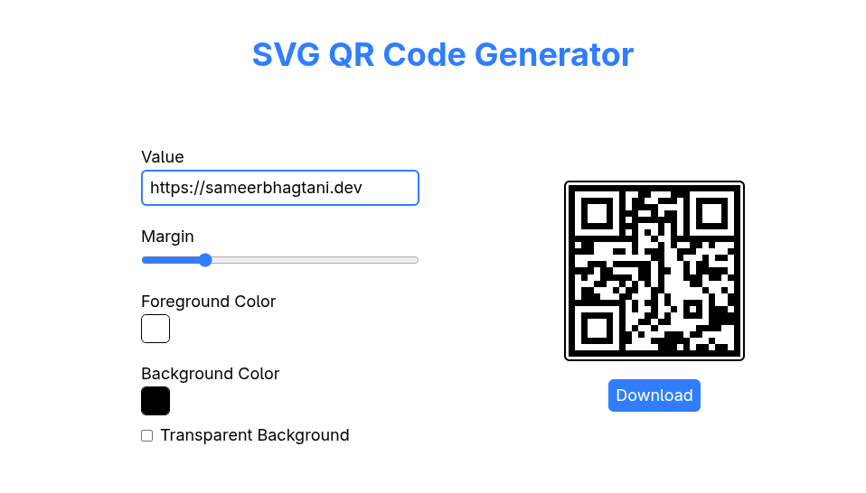

# 🖼️ SVG QR Code Generator

A sleek, minimal QR code generator built with **React**, **Vite**, and **Tailwind CSS** - powered by the [`qrcode.react`](https://www.npmjs.com/package/qrcode.react) library!  
Generate crisp, customizable SVG QR codes in seconds, and download them with a single click.

---

## ✨ Features

- 🎯 **Minimalist UI** – Clean, modern, distraction-free interface
- ⚡ **Instant QR Generation** – Type your value and see your QR code update live
- 🎨 **Customizable Colors** – Change foreground & background colors, or use transparent background
- ⬜ **Adjustable Margin** – Easy margin slider to perfect your QR’s look
- 🖼️ **SVG Output** – Crisp, scalable, and perfect for print or web
- ⬇️ **One-Click Download** – Download high-quality SVG QR codes instantly

---

## 🔥 Check it Out

Try it live here 👉 [https://svg-qr-code-generator.onrender.com/](https://svg-qr-code-generator.onrender.com/)

---

## 📸 Screenshot

---

## 📦 Built With

- [React](https://react.dev/)
- [Vite](https://vitejs.dev/)
- [Tailwind CSS](https://tailwindcss.com/)
- [qrcode.react](https://www.npmjs.com/package/qrcode.react)

---
